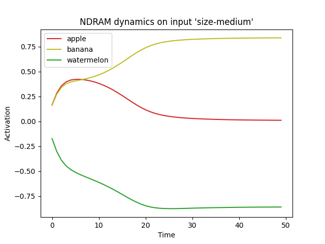

# Incubation Demo

This demo is based on Hélie & Sun (2010). A key element of that paper is to capture implicit processes associated with incubation, insight, and creative problem solving using an associative network in the bottom level of the NACS. 

The relevant type of associative network is the Non-linear Dynamic Recurrent Associative Memory (NDRAM; Chartier & Proulx, 2006). This is a Hopfield-type attractor network that can retrieve learned patterns from noisy or partial inputs. 

## Setup

The model presented here consists mainly of an NDRAM module in the bottom level whose outputs are propagated in a bottom-up fashion to the top level of the NACS using some predefined chunks. 

The predefined chunks are contrived to represent three different types of fruits: APPLE, BANANA, WATERMELON. Their features are basic visual characteristics such as color, shape, and size.

<table>
<thead>
<th></th>
<th>APPLE</th>
<th>BANANA</th>
<th>WATERMELON</th>
</thead>
<tbody>
<tr>
<td>color-red</td>
<td>+1</td>
<td>-1</td>
<td>-1</td>
</tr>
<tr>
<td>color-yellow</td>
<td>-1</td>
<td>+1</td>
<td>-1</td>
</tr>
<tr>
<td>color-green</td>
<td>-1</td>
<td>-1</td>
<td>+1</td>
</tr>
<tr>
<td>shape-round</td>
<td>+1</td>
<td>-1</td>
<td>+1</td>
</tr>
<tr>
<td>shape-oblong</td>
<td>-1</td>
<td>+1</td>
<td>-1</td>
</tr>
<tr>
<td>size-medium</td>
<td>+1</td>
<td>+1</td>
<td>-1</td>
</tr>
<tr>
<td>size-large</td>
<td>-1</td>
<td>-1</td>
<td>+1</td>
</tr>
</tbody>
</table>
<caption>Table 1. Predefined chunks and their features</caption>

## Experiment

The experimental setup involves training the associative network to settle on the feature patterns associated with each predefined chunk and observing how the model settles on learned patterns when cued with a feature to be matched by the retrieved chunk.

For testing, the model is cued with the feature `size-medium`, which matches both the APPLE chunk and the BANANA chunk but conflicts with the WATERMELON chunk. Thus a competition takes place between the APPLE and BANANA prototypes, the result of which can be read off of Figure 1.

<figcaption align = "center">Figure 1. Model settling on a prototype after training.</figcaption>

## Files

The file `main.py` contains the model definition and experimental code. The file `chunks.ccml` contains chunk definitions. The file `out.txt` is an instance of the output produced on the console by running `main.py`. The file `dynamics.png` is a graph representing the dynamics of the NDRAM during testing as explained above.

## References

Chartier, S., & Proulx, R. (2005). NDRAM: Nonlinear dynamic recurrent associative memory for learning bipolar and nonbipolar correlated patterns. <em>IEEE Transactions on Neural Networks</em>, <em>16(6)</em>, 1393-1400. <a>https://doi.org/10.1109/TNN.2005.852861</a>

Hélie, S. and Sun, R. (2010) Incubation, insight and creative problem solving: A unified theory and a connectionist model. <em>Psychological Review</em>, <em>117(3)</em>, 994-1024. <a> https://doi.org/10.1037/a0019532</a>

