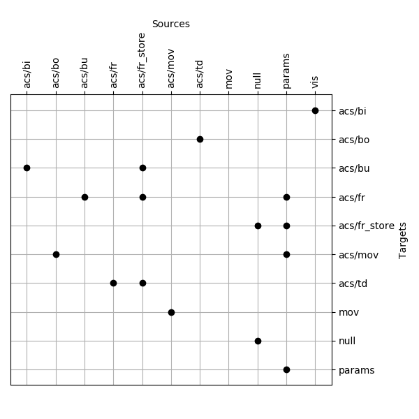

# Understanding `pyClarion`

## Overview

The basic representational unit of Clarion theory is the connectionist node. Even explicit knowledge, which consists of chunks and rules, is encoded using connectionist nodes of the localist variety. Clarion may therefore be viewed as a modular neural network architecture. This is the fundamental insight informing the design of `pyClarion`.

`PyClarion` agents are structured as collections of networked components. These networks are constructed using `Module` and `Structure` objects. 

The behavior of individual components are defined by `Process` objects, which reside in `Module` instances. `Process` objects compute activations and update parameters locally. They may have multiple output sites and they may expose a number of feature spaces for others to use.

All computations are carried out over pyClarion's native `NumDict` objects. To a first approximation, a  `NumDict` is a vector with named dimensions. Typically, `NumDict` keys are symbolic identifiers for elementary representational nodes.

### Node Symbols

Four main connectionist node types can be distinguished in Clarion theory: dimensions, features, chunks and rules. `pyClarion` provides node symbols for identifying each type of node. 

In many cases node symbols contain identifier strings. These strings are expected, in idiomatic usage, to be valid `pyClarion` URIs (explained below).

Dimension nodes are represented by `dimension` symbols, which consist of an identifier (`str`) and a lag value (`int`, optional).

```python
cl.dimension("dim_identifier", 0)
```

Feature nodes are represented by `feature` symbols, which consist of a dimension identifier (`str`), a value identifier (`str` or `int`, optional) and a lag identifier (`int`, optional).

```python
cl.feature("dim_identifier", "val_identifier", 0)
cl.feature("dim_identifier", 1, 0)
```

The `dimension` symbol associated with a given feature can be accessed through the `dim` property.

```python
assert cl.feature("dim", "val", 1).dim ==  cl.dimension("dim", 1)
```

Chunk nodes are represented by `chunk` symbols, which consist of a chunk identifier (`str`).

```python
cl.chunk("chunk_identifier")
```

Rule nodes are represented by `rule` symbols, which consist of a rule identifier (`str`).

```python
cl.rule("rule_identifier")
```

### An Example

To illustrate the concepts above, consider the task of simulating an agent in the style of Braitenberg vehicles. The following python script, included in the tutorial as `demo.py`, simulates such an agent that navigates a 2D environment. 

```python
"""
This demo simulates a simple Braitenberg vehicle in pyClarion.

The world is two dimensional. The agent can move left, right, up or down.
The agent also has four virtual light sensors, one for each cardinal direction.

The agent is configured to move away from light. The behavior is programmed as 
fixed rules in frs.ccml. 
"""


import pyClarion as cl
import random


def build(scfg, acfg, path):
    """
    Build a simple pyClarion agent.

    The agent has one stimulus module for inputs, one action module for 
    external actions. Action selection is driven by explicit fixed rules.  
    
    :param scfg: Stimulus config, passed to a `Receptors` constructor.
    :param acfg: Action config, passed to an `Actions` constructor.
    :param path: Path to a ccml file. Contents loaded to a `Store` instance.
    """

    # construct agent 
    with cl.Structure("agent") as agent:
        cl.Module("vis", cl.Receptors(scfg))
        params = cl.Module("params", cl.Repeat(), ["params"])
        cl.Module("null", cl.Repeat(), ["null"])
        with cl.Structure("acs"):
            cl.Module("bi", cl.CAM(), ["../vis"])
            cl.Module("bu", cl.BottomUp(), 
                ["fr_store#0", "fr_store#1", "fr_store#2", "bi"])
            cl.Module("fr", cl.ActionRules(), 
                ["../params", "fr_store#3", "fr_store#4", "bu"])
            cl.Module("td", cl.TopDown(), ["fr_store#0", "fr_store#1", "fr#0"])
            cl.Module("bo", cl.CAM(), ["td"])
            cl.Module("mov", cl.ActionSampler(), ["../params", "bo"], 
                ["../mov#cmds"])
            cl.Module("fr_store", cl.Store(), 
                ["../params", "../null", "../null", "../null"])
        cl.Module("mov", cl.Actions(acfg), ["acs/mov#0"])

    # set temperature parameters for rule & action selection
    params.output = cl.nd.NumDict({
        cl.feature("acs/fr#temp"): 1e-2,  
        cl.feature("acs/mov#temp"): 1e-2,
    })    

    # load fixed rules
    with open(path) as f:
        cl.load(f, agent)

    return agent


def main():
    # Stimulus config
    scfg = ["lum_L", "lum_R", "lum_U", "lum_D"]
    acfg = {"move": ["L", "R", "U", "D"]}

    # Build agent
    agent = build(scfg, acfg, "frs.ccml")
    vis = agent["vis"] # retrieve visual module
    mov = agent["mov"] # retrieve movement module

    # Pretty print all features defined in agent
    print("DEFINED FEATURES", end="\n\n")
    cl.pprint.pprint(cl.inspect.fspace(agent))
    print() # leave a blank line

    # Visualize agent structure (if matplotlib is installed)
    try:
        import matplotlib.pyplot as plt
    except ImportError:
        pass
    else:
        import pyClarion.utils.visualize as clv
        fig, ax = plt.subplots()
        ax = clv.adjacency_matrix(ax, agent)
        fig.set_size_inches(6, 6)
        fig.tight_layout()
        plt.show()

    # Run simulation for 20 steps 
    print("SIMULATION", end="\n\n")
    for i in range(20):
        vis.process.stimulate([random.choice(scfg)]) # Stimulate random sensor
        agent.step()

        display = [
            f"Stimulus: {cl.pprint.pformat(vis.output)}",
            f"Response: {cl.pprint.pformat(mov.output)}"
        ]
        if i: print()
        print(f"Step {i}:")
        for s in display:
            print("    ", s, sep="")


if __name__ == "__main__":
    main()
```

For now, let us focus on a single representative line in the above defnition. 

Here is the definition for the action selection module, with added keywords for clarity.

```python
cl.Module(
    name="mov", 
    process=cl.ActionSampler(), 
    i_uris=["../params", "bo"], 
    fs_uris=["../mov#cmds"])
```

Here, `cl.ActionSampler()` is a `Process` instance. The rest of the parameters are `pyClarion` URIs (or URI segments) which specify how this module networks with the rest of the agent.

The `name` argument is the name of the module, and therefore the last entry in the module's path. Locators for module inputs are passed to the module through the `i_uris` argument. Finally, the `fs_uris` argument points the module to action feature spaces. In this case, the module is given a locator for the command features exposed by the `'actions'` module.

`pyClarion` provides some tools for us to inspect and visualize the agents that we construct.

Here is a list of all features defined by the agent. These are the most basic representational units to which the agent has access.

```python
[feature(d='mov#move', v='D', l=0),
 feature(d='mov#move', v='L', l=0),
 feature(d='mov#move', v='R', l=0),
 feature(d='mov#move', v='U', l=0),
 feature(d='vis#lum_D', v=None, l=0),
 feature(d='vis#lum_L', v=None, l=0),
 feature(d='vis#lum_R', v=None, l=0),
 feature(d='vis#lum_U', v=None, l=0),
 feature(d='acs/fr#temp', v=None, l=0),
 feature(d='acs/fr#th', v=None, l=0),
 feature(d='acs/mov#temp', v=None, l=0),
 feature(d='mov#cmd/move', v=None, l=0),
 feature(d='mov#cmd/move', v='D', l=0),
 feature(d='mov#cmd/move', v='L', l=0),
 feature(d='mov#cmd/move', v='R', l=0),
 feature(d='mov#cmd/move', v='U', l=0)]
```

This list is generated by the following segment of the script.

```python
cl.inspect.fspace(agent)
```

Here is a visualization of the structure of the agent defined in the script above.



This image is generated by the following passage in the script.

```python
fig, ax = plt.subplots()
ax = clv.adjacency_matrix(ax, agent)
fig.set_size_inches(6, 6)
fig.tight_layout()
plt.show()
```

## URIs

URIs are used in pyClarion mainly for the following purposes:

- Identifying and locating components within agents
- Locating component outputs and feature spaces
- Naming dimensions, features, chunks, and rules

### URI Structure

A pyClarion URI consists of a relative or absolute path and an optional URI fragment. 

### Identifying and Locating Components

Within a `pyClarion` structure, every component has a unique path. Components may be retrieved by subscripting structures with a path segment.

#### Example

The absolute path for the action selector in the sample agent is given below.

```python
"/agent/acs/mov"
```

We can retrieve the component by subscripting the `agent` object as follows.

```python
agent["acs/mov"]
```

### Locating Component Outputs and Feature Spaces

When a component has a single output, its path is sufficient to locate its output. When a component has multiple outputs, they may each be located by appending the output index to the component path as a URI fragment. 

Feature spaces can be located in a similar manner through the use of URI fragments. To locate a feature space, simply append its name as a URI fragment to its owner's path.

#### Example

The action controller in the example has several outputs: one representing the selected commands and one representing the sampling distribution used to carry out the selection.

A component sitting at the same level as `acs` may locate the first output of the working memory controller with the following URI.

```python
"acs/mov#0"
```

The action selector knows what features to construct sampling distributions over because the action module exposes a set of command features. The selector is able to access these features thanks to the following reference.

```python
"../mov#cmds"
```

### Naming Dimensions, Features, Chunks, and Rules

URIs are also used to identify elementary nodes. Such URIs typically consist of a path from the root to the owning component and a fragment identifying the specific item. 

#### Example

The action controller has a parameter called `temp` for controlling the temperature of the Boltzmann distribution used in action selection. This parameter gets its value from a feature identified by the following symbol. 

```python 
cl.feature("acs/mov#temp")
``` 

### Composite URIs

In some cases, it is necessary to have composite URIs in order to prevent name clashes. Such cases may arise, for instance, when automatically generating features to control selective filtering of feature dimensions. 

Composite URIs are constructed by replacing the `"#"` symbol of the original URI with `"."` and prepending the result with a path to the new owning construct. This construction can be applied iteratively to accommodate more complex scenarios (e.g., inhibiting filtering signals).

#### Example

A composite URI derived from the URI for the temperature parameter may be as follows.

```python
cl.feature("compositor#acs/mov.temp")
```

This construction can be iterated without ambiguity.

```python
cl.feature("compositor2#compositor.acs/mov.temp")
```

## Controlling Agent Behavior

The two main ways to control agent behavior is to inject activations (i.e., stimulus) into the agent or to control the flow of activations (e.g., through fixed rules).

### Activation-setting

Some modules, like the `Stimulus` module, may provide APIs dedicated to receiving external input. 

It is also possible to directly set module outputs through the `Module.output` property.

```python
params.output = cl.nd.NumDict({
    cl.feature("acs/fr#temp"): 1e-2,  
    cl.feature("acs/mov#temp"): 1e-2,
})
```

### Declaring Explicit Knowledge with `ccml`

We often want an agent to have some pre-programmed behavior and knowledge. 

Pre-programmed behavior is typically defined in the form of fixed rules and pre-programmed knowledge as initial chunks and associative rules. `pyClarion` provides a programming language, called `ccml`, to facilitate specification of such initial agent knowledge. This language offers many conveniences for specifying fixed rules, some of which are demonstrated here.

A `ccml` script implementing fixed rules for Braitenberg-style behavior, called `"frs.ccml"`, is given below.

```
store acs/fr_store:
    ruleset bbv:
        for each:
            var direction: L R U D
            var opposite: R L D U
            rule:
                conc:
                    mov#cmd/move {opposite}
                cond:
                    vis#lum_{direction}
```

The contents of a ccml file can be loaded into an agent using the `cl.load()` function.

```python
# load fixed rules
with open(path) as f:
    cl.load(f, agent)
```

Rules defined in a ccml file are named according to their parent store and ruleset. They are also indexed by the line number and iteration index for easy reference. Thus the `ccml` script defined above will create four rules with the following identifiers.

```python
cl.rule("acs/fr_store#0006-000/bbv") # go right if light left
cl.rule("acs/fr_store#0006-001/bbv") # go left if light right
cl.rule("acs/fr_store#0006-002/bbv") # go down if light up
cl.rule("acs/fr_store#0006-003/bbv") # go up if light down
```

## Custom `Process` classes

In some cases, it may be necessary to extend `pyClarion` with new or customized components. This can be done by subclassing `Process` or one of its existing subclasses.

To illustrate this process, consider the following snippet, adapted from `networks.py` in the `components` subpackage.

```python
from dataclasses import dataclass
from typing import List, Tuple, Callable

import pyClarion as cl
import pyClarion.dev as cld


class NAM(cld.Process):
    """
    A neural associative memory.
    
    Implements a single fully connected layer. 
    
    For validation, each weight and bias key must belong to a client fspace.

    May be used as a static network or as a base for various associative 
    learning models such as Hopfield nets.
    """

    initial = cl.NumDict()

    def __init__(
        self,
        w: cl.NumDict[Tuple[cl.feature, cl.feature]],
        b: cl.NumDict[cl.feature],
        f: Callable[[NumDict[feature]], NumDict[cl.feature]] = cld.eye
    ) -> None:
        self.w = w
        self.b = b
        self.f = f

    def validate(self):
        fspace = set(f for fspace in self.fspaces for f in fspace())
        if (any(k1 not in fspace or k2 not in fspace for k1, k2 in self.w) 
            or any(k not in fspace for k in self.b)):
            raise ValueError("Parameter key not a member of set fspaces.")

    def call(self, x: cl.NumDict[feature]) -> cl.NumDict[feature]:
        return (self.w
            .mul_from(x, kf=cld.first)
            .sum_by(kf=cld.second)
            .add(self.b)
            .pipe(self.f))
```

The module `pyClarion.dev` provides some essential tools for implementing new `Process` subclasses, including exposing the `Process` class itself.

A `Process` subclass minimally requires the implementation of the `initial` attribute and the `call()` method. The `initial` attribute defines the initial output and the `call()` method computes outputs in all subequent steps.

The `validate()` method is a hook for checking whether a `Process` object has been correctly initialized. It is called during agent construction, after all components have been linked. 

A `Process` object may define its own feature spaces using the `reprs`, `flags`, `cmds`, and `nops` attributes, or it may use external feature spaces as in the case of the present `NAM` class or the `acs/mov` module in the initial example. 

External feature spaces are available as a sequence of callables through the `fspaces` property. This propety is populated during agent construction and each of its members returns the current state of a client feature space. 

For access to external feature space names, an `fspace_names` property is also available. This property returns a sequence of strings ordered to match `fspaces` and can be useful for sorting external fspaces into different groups.
